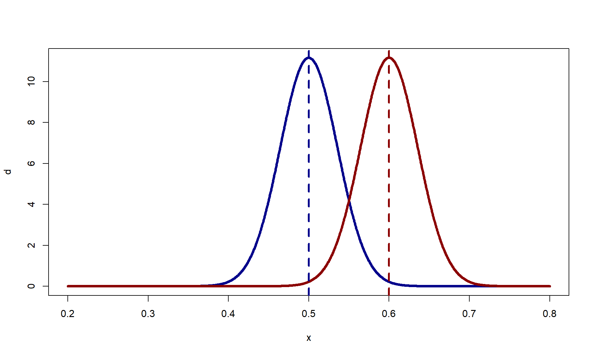

# 16.2 General principles of design

- In designing a study, it is generally better the double the effect size $\theta$ rather than double the sample size $n$. This is because standard errors decrease with the *square root* of sample size, not the full magnitude (or half if we are saying double).

### Sample size to acheive a specified probability of obtaining stat sig
Assume that we have some test of proportions. We wish to determine if $p > 1/2$ based on the estimate $\hat{p} = y/n$. Using a conservative s.e. of $\sqrt{0.5\cdot 0.5/n}$ (since for any binomial dist, the max variance is when $p=0.5$), the 95% conf interval is given by $[\hat{p}\pm 1.9\cdot 0.5 / \sqrt{n}]$, where 1.96 is 97.5% quantile of the standard normal. If our comparison point is 0.5, then we would have shown stat sig if $\hat{p} > 0.5 + 1.96\cdot 0.5/\sqrt{n}$. Consider the following null distribution for $H_0: p = 0.5$, with the area outside the 95% confidence interval shaded purple..


```r
library(magrittr)
library(rstanarm)
se <- 0.5/sqrt(196)
x <- seq(0.2, 0.8, length.out=1e3)
d <- dnorm(x, mean=0.5, sd=se)
plot(x, d, lwd=4, type='l', col='darkblue')

crit_value <- qnorm(0.975, 0.5, se)

polygon(c(x[x>crit_value], rev(x[x > crit_value])),
        (x > crit_value) %>% {c(d[.], rep(0,sum(.)))},
        col=adjustcolor('purple', 0.7), border=NA)

crit_value <- qnorm(0.025, 0.5, se)
polygon(c(x[x<crit_value], rev(x[x < crit_value])),
        (x < crit_value) %>% {c(d[.], rep(0,sum(.)))},
        col=adjustcolor('purple', 0.7), border=NA)
lines(x, d, lwd=4, type='l', col='darkblue')
```


Now, if we want to find the power, we must assume some effect size. For instance, $p=0.6$. It might be tempting to test whether $p = 0.6 > 0.5 + 1.96 \cdot  0.5/\sqrt{n}$ and then find a sample size from this formula, but this is incorrect. The assumption is that $p=0.6$, which in turn makes the standard error $\sqrt{0.6\cdot 0.4/n}$. So how would one find the right sample size - we need to specify the power of the test. Notice the null $H_0: p=0.5$ and alternative $H_A:p=0.6$ plotted below:


```r
x <- seq(0.2, 0.8, length.out=1e3)
d1 <- dnorm(x, mean=0.5, sd=se)
d2 <- dnorm(x, mean=0.6, sd=se)
plot(x, d, lwd=4, type='l', col='darkblue')
lines(x, d2, lwd=4, type='l', col='darkred')
abline(v=0.5, lty=2, col='darkblue', lwd=3)
abline(v=0.6, lty=2, col='darkred', lwd=3)
```


Power is the defined as the probability of that we will correctly reject the null when the alternative is true. This is the probability that $\hat{p} > 0.5 + 1.96\cdot se$, given that $p=0.6$. The shaded region below shows this:


```r
x <- seq(0.2, 0.8, length.out=1e3)
d1 <- dnorm(x, mean=0.5, sd=se)
d2 <- dnorm(x, mean=0.6, sd=se)
plot(x, d, lwd=4, type='l', col='darkblue')
crit_value <- qnorm(0.975, 0.5, se)

polygon(c(x[x>crit_value], rev(x[x > crit_value])),
        (x > crit_value) %>% {c(d2[.], rep(0,sum(.)))},
        col=adjustcolor('purple', 0.7), border=NA)
lines(x, d2, lwd=4, type='l', col='darkred')
abline(v=0.5, lty=2, col='darkblue', lwd=3)
abline(v=0.6, lty=2, col='darkred', lwd=3)
```



Notice, we can also find the start of the rejection region using a given power value. If we set power at 80%, then the start of the rejection region is given by $0.6 - \text{qnorm(0.2)}\cdot se = 0.6+0.84\cdot se$. Thus, we can set the two equations for the start of the rejection region equal and obtain $$0.5 + 1.96\cdot se = 0.6 + 0.84\cdot se$$

Recall that $se=\sqrt{0.4*0.6/n}$ since $p=0.6$ is the assumption if the alternative is true:

$$
\begin{align}
0.5 + 1.96\cdot se &= 0.6 - 0.84\cdot se \\
2.8\cdot se &= 0.1 \\
\end{align}
$$
Just stopping here because this is a big result and is used as a rule of thumb all the time. If we want 80% at 5% significance level, the effect size must be greater than or equal to 2.8 standard errors.

A bit more algebra shows that $n = (0.49 \cdot 2.8/0.1)^2$.


# 16.4
### You need 4 times the sample size to estimate an interaction that is the same size as the main effect
- If a study is designed to have 80% power to detect a main effect at a 95% confidence interval, then that implies that the true effect size is 2.8 s.e. away from zero.


```{.r .fold-show}
pnorm(2.8, 1.96, 1)
```

```
## [1] 0.7995458
```
- Suppose that the interaction of interest is the same size as the main effect
- If the average treatment effect on the entire population is $\theta$
  - Assume an effect of $0.5\theta$ among women and $1.5\theta$ among men
  - Then the interaction - the difference in treatment effect comparing men to women - is the same size as the main effect. 
- The standard error of the interaction is roughly *twice* the standard error of the main effect:

\newline

- Assume constant variance between groups (should be good for binary data) and even split in sample size
- The difference between treatment and control $\bar{y}_T - \bar{y}_C$, has a standard error of $\sqrt{\sigma^2/(n/2) + \sigma^2/(n/2)} = 2\sigma/\sqrt{n}$
- The estimate of the interaction $(\bar{y}_{T,\text{men}} - \bar{y}_{C,\text{men}}) - (\bar{y}_{T,\text{women}} - \bar{y}_{C,\text{women}})$ has a standard error of $\sqrt{\sigma^2/(n/4) + \sigma^2/(n/4) + \sigma^2/(n/4) + \sigma^2/(n/4)} = 4\sigma/\sqrt{n}$
- If we have set the sample size such that $2\sigma/\sqrt{n}$ the minimum standard error for 80% and 95% CI, then we need 4 times $n^\prime=4n$ the sample size such that 

\begin{align}
\frac{4\sigma}{\sqrt{n^\prime}} &= \frac{4\sigma}{\sqrt{4n}}\\
&= \frac{4\sigma}{2\sqrt{n}}\\
&= \frac{2\sigma}{\sqrt{n}}
\end{align}

So what would be the power of your estimate if we assumed that the main effect and study was set up in such a way that we achieved 80% at 95% CI? Well, we would still only reject if the z-score is above 1.96, and we know that the effect size on the standardized scale is 2.8 for 80%, then the interaction would be at 1.4 (this is if we didn't perform the $4n$ correction above.


```{.r .fold-show}
# Show two different methods
pnorm(1.4, 1.96, 1) |> round(2)
```

```
## [1] 0.29
```

```{.r .fold-show}
rnorm(1e6, 1.4) %>% `>`(1.96) %>% mean() %>% round(2) %>% print()
```

```
## [1] 0.29
```
We can also use the simulation for the second method to show the problem of the "winners curse". If we condition on significance, what order of magnitude will we over estimate the effect?


```{.r .fold-show}
raw <- rnorm(1e6, 1.4, 1)
signif <- raw > 1.96
mean(raw[signif]) |> round(2)
```

```
## [1] 2.59
```
We will overestimate the size by a factor of 2.6!

### You need 16 times the sample size to estimate an interaction that is half the size as the main effect
- Lets do some simulations
- Assume that the true coefficients are 0. 
  - We don't really need a value since our main goal is looking at standard errors
- Assume that predictors are independent
- Let's use $x_1$ as our control/treatment variable and $x_2$ as our male/female variable. Our equation with group interactions then becomes

$$y = \beta_1 x_1 + \beta_2 x_2 + \beta_3 (x_1\cdot x_2)$$

Now, let's write out equation for our 4 set of possible points $\{(y_{T,M}, x_T, x_M), (y_{C,M}, x_C, x_M), (y_{T,W}, x_T, x_W), (y_{C,W}, x_C, x_W)\}$. Further, $x_T, x_C$ are the two indicator (not necessarily 0/1) values $x_1$ can take, and $x_M, x_W$ are the two values $x_2$ can take. Of course, the $y$ values will have some sort of measurement error in them which requires some estimation procedure and not some simple algebra. The four equations are as follows:

\begin{align}
y_{T,M} &= \beta_1 x_T + \beta_2 x_M + \beta_3 (x_T\cdot x_M) \\
y_{C,M} &= \beta_1 x_C + \beta_2 x_M + \beta_3 (x_C\cdot x_M) \\
y_{T,W} &= \beta_1 x_T + \beta_2 x_W + \beta_3 (x_T\cdot x_W) \\
y_{C,W} &= \beta_1 x_C + \beta_2 x_W + \beta_3 (x_C\cdot x_W)
\end{align}

So how do we calculate the estimate for $(y_{T,M} - y_{C,M}) - (y_{T,W} - y_{C,W})$:
\begin{align}
(y_{T,M} - y_{C,M}) - (y_{T,W} - y_{C,W}) &= (\beta_1 x_T + \beta_2 x_M + \beta_3 (x_T\cdot x_M) - (\beta_1 x_C + \beta_2 x_M + \beta_3 (x_C\cdot x_M)) - (y_{T,W} - y_{C,W}) \\ 
&= \beta_1 (x_T - x_C) + \beta_3 (x_T\cdot x_M - x_C\cdot x_M) - (y_{T,W} - y_{C,W}) \\
&= \beta_1 (x_T - x_C) + \beta_3 (x_T\cdot x_M - x_C\cdot x_M) - (\beta_1 x_T + \beta_2 x_W + \beta_3 (x_T\cdot x_W) - \beta_1 x_C - \beta_2 x_W - \beta_3 (x_C\cdot x_W))\\
&= \beta_3 ((x_T\cdot x_M - x_C\cdot x_M) - (x_T\cdot x_W - x_C\cdot x_W))
\end{align}

Then, $\beta_3 = \frac{(y_{T,M} - y_{C,M}) - (y_{T,W} - y_{C,W})}{(x_T\cdot x_M - x_C\cdot x_M) - (x_T\cdot x_W - x_C\cdot x_W)}$. \\

From the same logic, it is also not hard to show $$\beta_1 = \frac{y_{T,M} - y_{C,M}}{}$$


```{.r .fold-show}
n <- 1e3; sigma <- 10
y <- rnorm(n, 0, sigma)
x1 <- sample(c(0.5, -0.5), n, replace=T)
# x1 <- rnorm(n, 0, 1)
y <- rnorm(n,(x1+0.5)*2,sigma)
x2 <- sample(c(0.5, -0.5), n, replace=T)

fake <- data.frame(y,x1,x2)

fit_1 <- stan_glm(y ~ x1, data=fake)
fit_2 <- stan_glm(y ~ x1 + x2 + x1:x2, data=fake)
```

```r
print(fit_1); print(fit_2)
```

```
## stan_glm
##  family:       gaussian [identity]
##  formula:      y ~ x1
##  observations: 1000
##  predictors:   2
## ------
##             Median MAD_SD
## (Intercept) 0.9    0.3   
## x1          1.6    0.6   
## 
## Auxiliary parameter(s):
##       Median MAD_SD
## sigma 10.3    0.2  
## 
## ------
## * For help interpreting the printed output see ?print.stanreg
## * For info on the priors used see ?prior_summary.stanreg
```

```
## stan_glm
##  family:       gaussian [identity]
##  formula:      y ~ x1 + x2 + x1:x2
##  observations: 1000
##  predictors:   4
## ------
##             Median MAD_SD
## (Intercept)  0.9    0.3  
## x1           1.6    0.6  
## x2          -0.1    0.6  
## x1:x2       -1.4    1.3  
## 
## Auxiliary parameter(s):
##       Median MAD_SD
## sigma 10.3    0.2  
## 
## ------
## * For help interpreting the printed output see ?print.stanreg
## * For info on the priors used see ?prior_summary.stanreg
```

My note to you when you get back to this: he is using -0.5 and 0.5 so the mean of the control and treated indicators is zero. The coefficient is not the ATE. Refer back to this: https://statmodeling.stat.columbia.edu/2023/11/09/you-need-16-times-the-sample-size-to-estimate-an-interaction-than-to-estimate-a-main-effect-explained/


```r
2*10/sqrt(1e3)
```

```
## [1] 0.6324555
```

```r
sqrt(8)*10/sqrt(1e3)
```

```
## [1] 0.8944272
```

