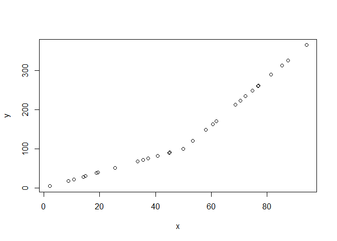

# Chapter 1

## 1.5

- Generalized degrees of freedom (GDF)
  - Index of “data dredging” or overfitting that has been done to the
    model

# Chapter 2

## 2.1 - 2.2

- Let $C(Y|X)$ be some property of the distribution of $Y$ given $X$.
  - For example, in ordinary linear regression $C(Y|X) = E[Y|X]$
- For general linear regression, $C(Y|X) = g(X\beta)$.
  - For logistic regression that is
    $C(Y|X) = g(X\beta) = (1+\exp(-X\beta))^{-1}$.
  - Clearly in logistic regression $C(Y|X)$ is not linear in $X\beta$
- Define a transformation on $C(Y|X)$ called $h$ so $h(C(Y|X))$ is
  linear in $X\beta$
  - In other words, $h(u) = g^{-1}(u)$
- For logistic regression $h(u) = \text{logit}(u) = \log(u/(1-u))$ (log
  odds)
- Assume that $h(C(Y|X))=C(Y|X)$ for ease of notation since we will be
  using it quite a lot, are we are mostly concerned with linear
  relationships

## 2.3

For nominal predictors with 4 groups, model is sufficient with
$C(Y|T)=X\beta=\beta_0 + \beta_1X_1 + \beta_2 X_2 + \beta_3X_3$. Notice
that for a ANOVA, we only need to test
$H_0: \beta_1 = \beta_2 = \beta_3 = 0$ and not include $beta_0$ since
the other coefficients are just perturbations around $\beta_0$. In other
words, if $\beta_1 = \beta_2 = \beta_3 = 0$ then
$\beta_1 = \beta_2 = \beta_3 = \beta_0$ and all coefficients are equal.

### 2.3.2 Interactions

Consider the following model
$$C(Y|X) = \beta_0 + \beta_1X_1 + \beta_2X_2 + \beta_3X_1X_2$$ where
$x=(age,sex)$ and $X_2=I(x_2=\text{female})$. Refer to table 2.2 for
some great examples of hypothesis testing and what the interaction
actually means.

### 2.4.1

Basically never categorize your continuous data. If you do this based on
values of $Y$, your type I and type II error are both elevated. If you
really need cutpoints (unless otherwise theoretically motivated) on some
predictor $X$, use a spline so it is at least smooth.

### 2.4.2

Consider the model: $$C(Y|X_1) = \beta_0 + \beta_1X_1 + \beta_2X^2$$ If
the model is truly linear $X_1$, $\beta_2$ will be zero. Use
$H_0: \beta_2 = 0$ to test.

### 2.4.3

Suppose the x-axis is divided into intervals with endpoints at $a$, $b$,
and $c$ called knots. The linear spline function is given by
$$f(X) = \beta_0 + \beta_1X + \beta_2(X-a)_+ + \beta_3(X-b)_+ + \beta_4(X-c)_+$$

where $(u)_+ = u$ if $u > 0$, $0$ otherwise.

``` r
n <- 30
x <- runif(n,0,100)
y <- ifelse(x <= 50, x*2 + rnorm(n,0,0.01), x*2 + (x-50)*4 + rnorm(n,0,0.01))
plot(x,y)
```

<!-- -->

``` r
x1 <- ifelse(x - 50 <=0, 0, x - 50)
lm(y ~ x + x1)
```

    ## 
    ## Call:
    ## lm(formula = y ~ x + x1)
    ## 
    ## Coefficients:
    ## (Intercept)            x           x1  
    ##   -0.003842     2.000031     3.999990

Overall linearity in $X$ can be tested by testing
$H_0: \beta_2 = \beta_3 = \beta_4$.
